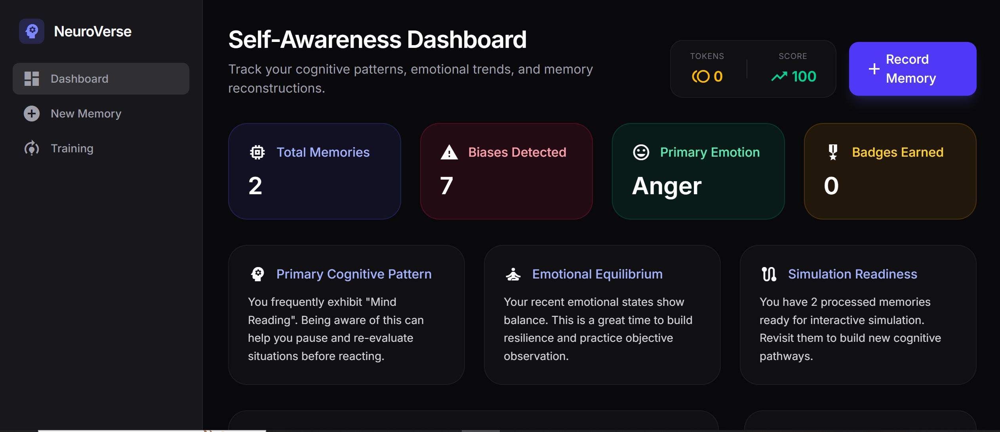

# 🧠 NeuroVerse — The AI Mind Simulator

NeuroVerse is an AI-driven system that transforms real-life experiences into interactive simulations, allowing users to rethink decisions, identify cognitive biases, and practice better responses in a safe, adaptive environment.

---

## 🚀 The Idea

Most people don’t lack awareness—they lack the ability to *rehearse better decisions*.

NeuroVerse bridges this gap by converting:

* Personal experiences
* Emotional scenarios
* Behavioral patterns

into structured, replayable simulations.

---

## ⚙️ How It Works

1. **User Input**
   Users describe a real situation or experience.

2. **AI Processing**
   The system extracts context, intent, and possible cognitive biases.

3. **Scenario Generation**
   A branching, decision-based simulation is created.

4. **Interaction Loop**
   Users make choices → outcomes adapt dynamically.

5. **Learning Feedback**
   The system evolves based on user responses over time.

---

## 🎮 Core Features

* 🧠 Cognitive bias identification
* 🌳 Branching decision simulations
* 🔁 Adaptive scenario generation
* 📊 Behavior-driven learning loop
* 🏆 Gamified feedback (points, badges, trophies)

---

## 🛠 Tech Stack

* **Frontend:** Angular
* **Language:** TypeScript
* **UI:** HTML, CSS
* **Authentication:** Firebase Auth
* **Data Handling:** JSON-based structures
* **AI Layer:** Gemini API

---

## 🔐 Environment Setup

Create a `.env` file based on `.env.example`:

```env
GEMINI_API_KEY="your_api_key_here"
APP_URL="http://localhost:4200"
```

---

## 💻 Running Locally

```bash
npm install
npm run dev
```

---

## 📸 Preview

<p align="center">
  
</p>

---

## 🧩 Key Engineering Decisions

* Structured AI outputs into deterministic simulation nodes instead of raw text
* Designed a feedback loop to make scenarios adaptive, not static
* Separated AI generation from application logic for control and consistency

---

## ⚠️ Security Note

API keys are managed using environment variables and restricted in Google Cloud Console.

---

## 🔮 Future Scope

* Deeper behavioral modeling
* Smarter long-term learning systems
* Advanced scenario personalization
* Multi-user simulation environments

---

## 👨‍💻 Author

Pulkit Pandey

---

## ⭐ Final Thought

NeuroVerse isn’t just about AI-generated content—it’s about building a system where users can actively improve how they think and respond.
